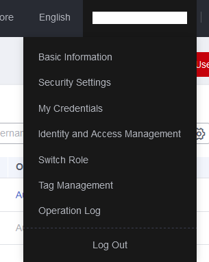
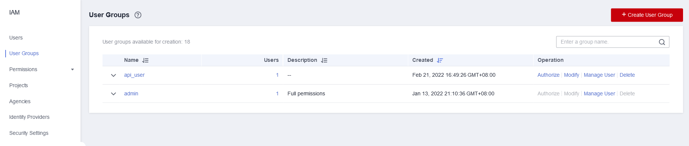
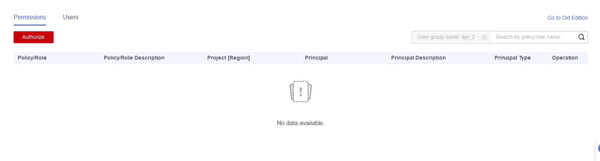
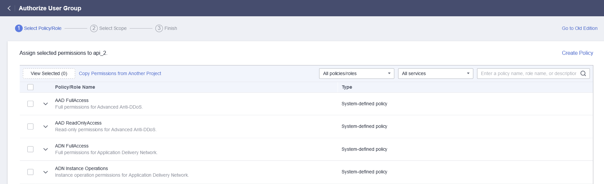
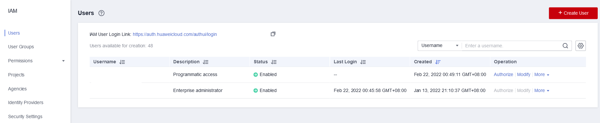
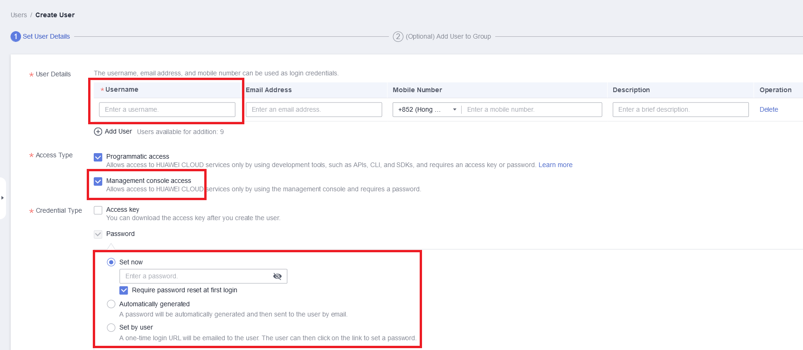
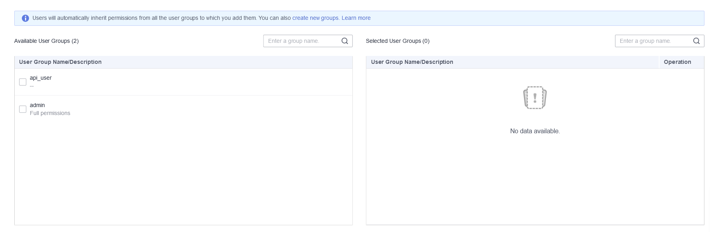

# How-to: Image Tagging from scratch

**Image tagging only works in some regions. For this case, we'll use `ap-southeast-1` (Hong Kong).**

## Authorisation - IAM User

IAM users behave like sub-users under your main account, and can be created to perform tasks using a restricted user account context. You can even disable login to the HUAWEI CLOUD Console for these sub-users.

### **Part 1: Creating a user group**

Users within a group can share the same permissions to access resources.
**You can skip to Part 2 if you don't need to care about security.**

1. **Go to IAM**.



2. **Go to User Groups** and click **Create**.



3. Key in the **name** of the User Group.

4. Click on the newly-created User Group.

5. Click **Authorize**.



6. **Give this User Group the relevant permissions.** (e.g. if you want it to just be able to access Image Tagging, select just that.) For security reasons, it is preferable to only give what is necessary. *However, since this is a short-run competition, you could also give it every permission needed.*



7. Once the permissions are assigned, just **Next** and then **Finish**.

### **Part 2: Creating an IAM user**

You will use this user to access the Image Tagging API.

1. Go to **IAM** > **Users** and then click **Create**



2. Only these fields matter. For username, anything would do. I recommend disabling Management Console Access, and selecting "Automatically generated" for password.



3. Assign this user to **either** the ADMIN group (will give it full access to everything in your account, user with caution) or the group you created in Part 1 (if you want to play it safe.)



4. **Next**. Save the password when prompted to. It will be inside the CSV file you download.

## Accessing Image Tagging

Copy this JSON into a file somewhere, we'll assume it's called "post-auth.json":
```JSON
{
  "auth": {
    "identity": {
      "methods": [
        "password"
      ],
      "password": {
        "user": {
          "domain": {
            "name": "MAIN ACCOUNT NAME"
          },
          "id": "IAM USER ID",
          "password": "IAM USER PASSWORD FROM CSV"
        }
      }
    },
    "scope": {
      "project": {
        "name": "ap-southeast-1"
      }
    }
  }
}
```

**You must Subscribe to the Image Tagging service in the relevant region (here, Hong Kong / ap-southeast-1) first.**

1. Click on the user you just created.
2. Copy the **User ID**.
3. Replace the IAM USER ID with the User ID you copied.
4. Replace the IAM USER PASSORD with the password from the CSV.
5. Replace the MAIN ACCOUNT NAME with your hid_(...) ID.

6. **cURL:**
```sh
curl -X POST https://iam.myhuaweicloud.com/v3/auth/tokens --header 'content-type: application/json'  -d "@post-auth.json" -v
```

7. Copy out the value of the `X-Subject-Token:` header.
8. In your shell, do `token="PASTE THE TOKEN"`.

9. Paste into "post-img.json":
```JSON
{
  "image":"",
  "url":"https://ais-sample-data.obs.myhuaweicloud.com/tagging-normal.jpg",
  "language": "zh",
  "limit": 5,
  "threshold": 30.0
}
```

10. **cURL:**
```sh
curl -X POST https://image.ap-southeast-1.myhuaweicloud.com/v1.0/image/tagging --header 'Content-Type: application/json' --header "X-Auth-Token: $token" -v -d "@post-img.json"
```